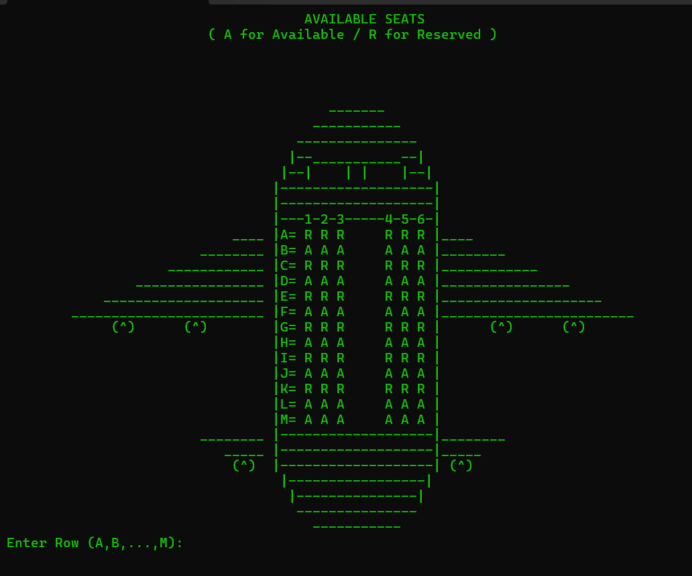

# ✈️ AirFast - Airline Reservation System #

## 📌 Project Overview

**AirFast** is a C++ console-based airline reservation system built using Object-Oriented Programming principles. It simulates a small airline’s seat reservation, modification, and cancellation process. This system was developed as part of an academic project at FAST-NUCES (Karachi Campus) for the course on Object-Oriented Programming.

---

## 📖 Abstract

This program models an airline booking system for a fictional airline called **AirFast**. The system handles two destinations: one domestic (Islamabad) and one international (Shanghai). Each destination offers three flights: Morning, Evening, and Night. The system allows users to:

- Book a seat for any flight.
- View available seats.
- Cancel an existing reservation.
- Modify a booking to an earlier or later flight.

The seating structure is represented in a visual layout with rows (A–M) and seat numbers (1–6), mimicking an actual airplane layout.

---

## 🖼️ Plane Layout Preview

**Below is a visual representation of the plane structure used in the system:**

---

## 🧰 Features

- **Seat Visualization**: Displays a visual layout of airplane seats (Available/Reserved).
- **Booking Functionality**: Users can enter personal details, select a flight, and choose a seat.
- **Ticket Types**:
  - Basic
  - Value
  - Extra
- **Cancellation**: Based on unique ticket ID.
- **Modification**:
  - Delay to a later flight.
  - Change to an earlier flight.
- **Flight Management**: Separate arrays manage different flights for each destination.

---

## 🛠️ Technologies Used

- **Language**: C++
- **Environment**: Windows Console
- **Library**: `<windows.h>` for `Sleep()` and screen color control

---

## 👥 Team Members

| Name            | Member ID   |
|-----------------|-------------|
| Jahanzeb Khairi | 22K-4746    |
| Usman Islam     | 22K-4708    |

---

## 📝 Notes

- The data is not persistent; no database or file I/O is used.
- Seat data resets each time the program runs.
- The system is suitable for academic demonstration of OOP concepts like inheritance, encapsulation, and polymorphism.

---

## 🧾 License

This project is for educational purposes only.
